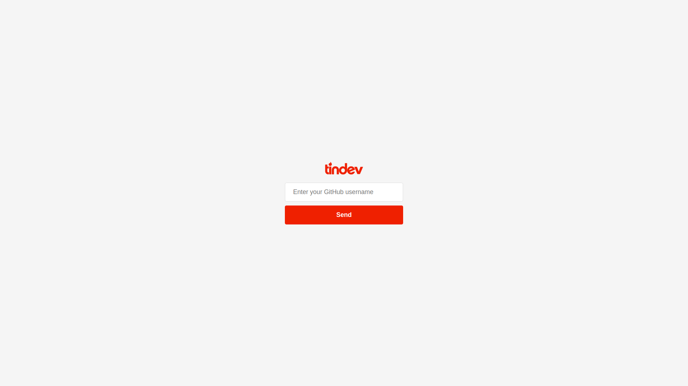
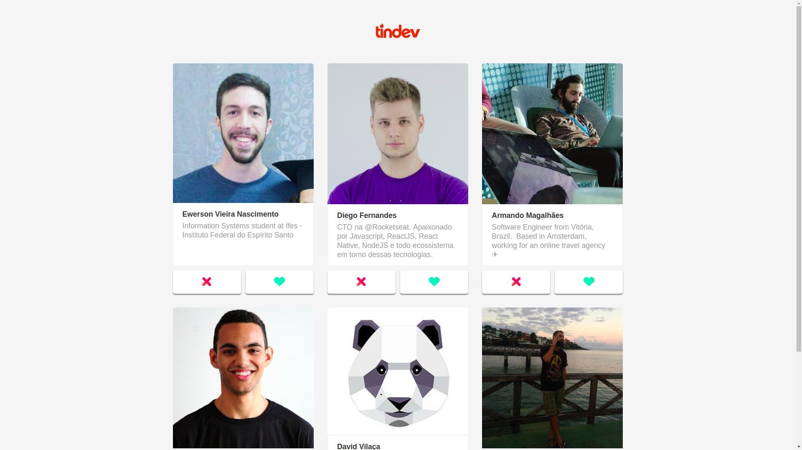
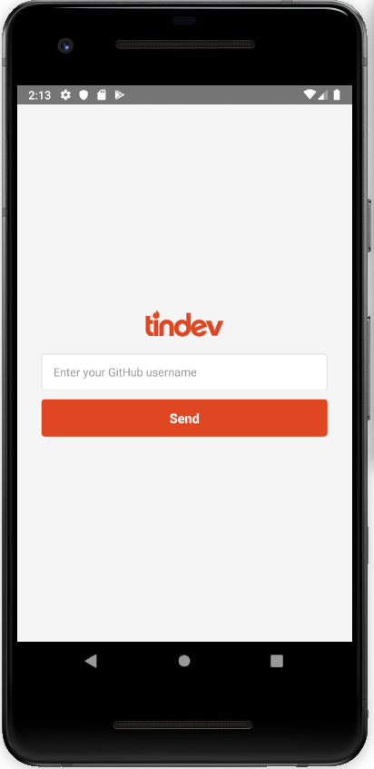
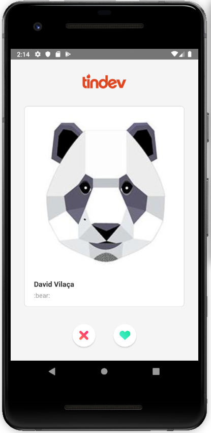
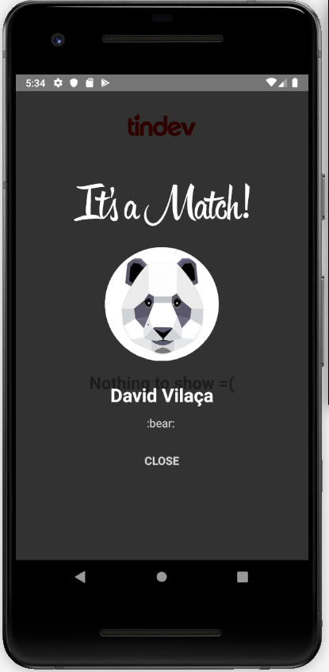

# Tindev 

A Tinder-like app for developers who want to get in touch with other developers working with the same stack.

## Environment
- OS: Ubuntu 18.04
- Text editor: VS Code 1.37.0
- Android emulator: Android Studio

## Tools
- Axios
- Express
- Insomnia
- MongoDB Atlas
- MongoDB Compass
- Mongoose
- Node.js v10.x
- ReactJS
- React Native
- Yarn
- Socket.IO

## Running the app:
Start the server inside the ```backend``` folder:
```bash
$ yarn dev
```

Run the web version inside the ```frontend``` folder:
```bash
$ yarn start
```

To run the mobile version for the first time, go to the ```mobile``` folder and do:
```bash
$ react-native run-android
```

If you have already ran the app before, just enter:
```bash
$ react-native start
```

## Frontend





## Mobile
<p align="center">
    
</p>

<p align="center">
    
</p>

<p align="center">
    
</p>